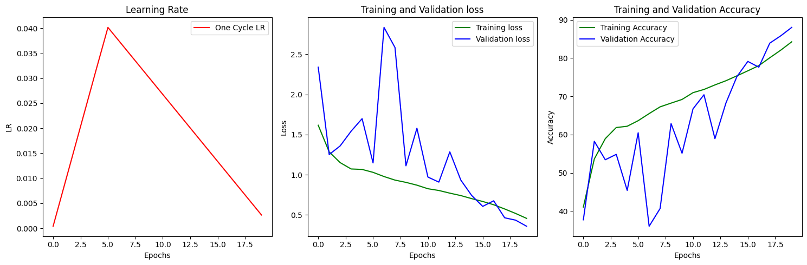
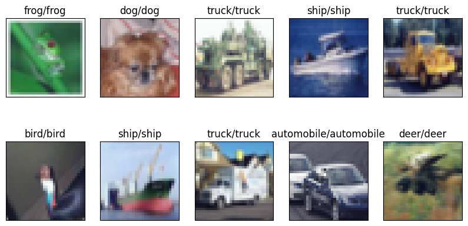
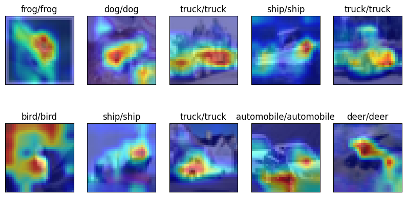
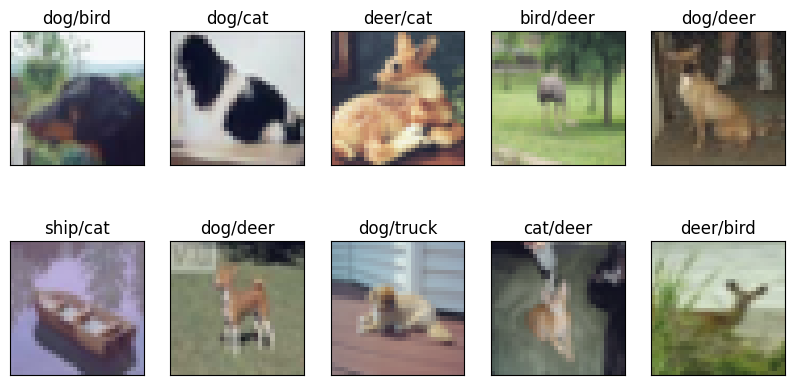
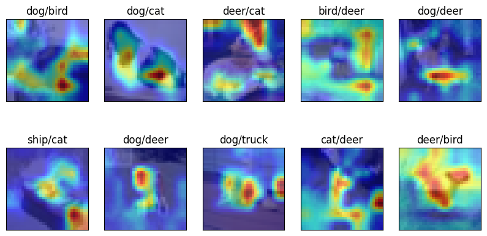

# Resnet with GradCam Pytorch

### Logs

| Epoch | LR       | Time    | TrainLoss | TrainCorrect | TrainAcc | ValLoss  | ValCorrect | ValAcc |
| ----- | -------- | ------- | --------- | ------------ | -------- | -------- | ---------- | ------ |
| 1     | 0.000402 | 00m 48s | 1.615961  | 20524        | 41.05 %  | 2.339794 | 3771       | 37.71% |
| 2     | 0.008378 | 00m 50s | 1.283991  | 26816        | 53.63 %  | 1.251196 | 5825       | 58.25% |
| 3     | 0.016354 | 00m 48s | 1.15028   | 29466        | 58.93 %  | 1.358793 | 5342       | 53.42% |
| 4     | 0.024330 | 00m 48s | 1.071355  | 30924        | 61.85 %  | 1.542268 | 5483       | 54.83% |
| 5     | 0.032306 | 00m 48s | 1.065605  | 31092        | 62.18 %  | 1.698282 | 4541       | 45.41% |
| 6     | 0.040173 | 00m 48s | 1.029223  | 31822        | 63.64 %  | 1.146925 | 6048       | 60.48% |
| 7     | 0.037493 | 00m 48s | 0.97693   | 32747        | 65.49 %  | 2.835435 | 3603       | 36.03% |
| 8     | 0.034813 | 00m 47s | 0.932608  | 33629        | 67.26 %  | 2.585027 | 4067       | 40.67% |
| 9     | 0.032133 | 00m 48s | 0.904178  | 34117        | 68.23 %  | 1.110657 | 6287       | 62.87% |
| 10    | 0.029454 | 00m 47s | 0.86933   | 34597        | 69.19 %  | 1.578767 | 5513       | 55.13% |
| 11    | 0.026774 | 00m 48s | 0.82504   | 35484        | 70.97 %  | 0.970726 | 6673       | 66.73% |
| 12    | 0.024094 | 00m 47s | 0.8031    | 35903        | 71.81 %  | 0.907527 | 7042       | 70.42% |
| 13    | 0.021415 | 00m 50s | 0.769941  | 36497        | 72.99 %  | 1.284716 | 5894       | 58.94% |
| 14    | 0.018735 | 00m 50s | 0.739687  | 37042        | 74.08 %  | 0.933146 | 6824       | 68.24% |
| 15    | 0.016055 | 00m 49s | 0.701338  | 37682        | 75.36 %  | 0.739607 | 7515       | 75.15% |
| 16    | 0.013375 | 00m 50s | 0.666234  | 38341        | 76.68 %  | 0.604902 | 7914       | 79.14% |
| 17    | 0.010696 | 00m 50s | 0.625308  | 39019        | 78.04 %  | 0.674433 | 7763       | 77.63% |
| 18    | 0.008016 | 00m 47s | 0.572856  | 40046        | 80.09 %  | 0.462768 | 8392       | 83.92% |
| 19    | 0.005336 | 00m 48s | 0.516873  | 41041        | 82.08 %  | 0.433308 | 8583       | 85.83% |
| 20    | 0.002656 | 00m 47s | 0.455471  | 42132        | 84.26 %  | 0.357388 | 8803       | 88.03% |

### Logs

### Correct Images

#### Gradcam

### InCorrect Images

#### Gradcam

